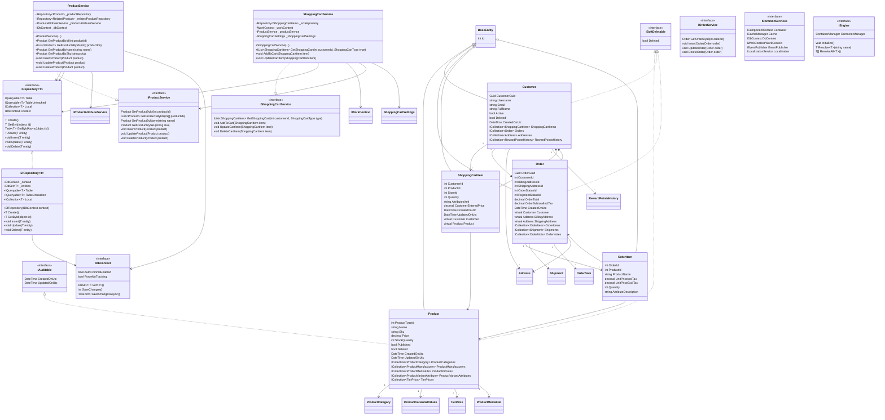

```mermaid
classDiagram
    class BaseEntity {
        int Id
    }

    class IAuditable {
        <<interface>>
        DateTime CreatedOnUtc
        DateTime UpdatedOnUtc
    }

    class ISoftDeletable {
        <<interface>>
        bool Deleted
    }

    class IRepository~T~ {
        <<interface>>
        IQueryable~T~ Table
        IQueryable~T~ TableUntracked
        ICollection~T~ Local
        T Create()
        T GetById(object id)
        Task~T~ GetByIdAsync(object id)
        T Attach(T entity)
        void Insert(T entity)
        void Update(T entity)
        void Delete(T entity)
        IDbContext Context
    }

    class EfRepository~T~ {
        -IDbContext _context
        -IDbSet~T~ _entities
        +EfRepository(IDbContext context)
        +IQueryable~T~ Table
        +IQueryable~T~ TableUntracked
        +ICollection~T~ Local
        +T Create()
        +T GetById(object id)
        +void Insert(T entity)
        +void Update(T entity)
        +void Delete(T entity)
    }

    class IDbContext {
        <<interface>>
        DbSet~T~ Set~T~()
        int SaveChanges()
        Task~int~ SaveChangesAsync()
        bool AutoCommitEnabled
        bool ForceNoTracking
    }

    class Product {
        int ProductTypeId
        string Name
        string Sku
        decimal Price
        int StockQuantity
        bool Published
        bool Deleted
        DateTime CreatedOnUtc
        DateTime UpdatedOnUtc
        ICollection~ProductCategory~ ProductCategories
        ICollection~ProductManufacturer~ ProductManufacturers
        ICollection~ProductMediaFile~ ProductPictures
        ICollection~ProductVariantAttribute~ ProductVariantAttributes
        ICollection~TierPrice~ TierPrices
    }

    class Customer {
        Guid CustomerGuid
        string Username
        string Email
        string FullName
        bool Active
        bool Deleted
        DateTime CreatedOnUtc
        ICollection~ShoppingCartItem~ ShoppingCartItems
        ICollection~Order~ Orders
        ICollection~Address~ Addresses
        ICollection~RewardPointsHistory~ RewardPointsHistory
    }

    class Order {
        Guid OrderGuid
        int CustomerId
        int BillingAddressId
        int ShippingAddressId
        int OrderStatusId
        int PaymentStatusId
        decimal OrderTotal
        decimal OrderSubtotalInclTax
        DateTime CreatedOnUtc
        virtual Customer Customer
        virtual Address BillingAddress
        virtual Address ShippingAddress
        ICollection~OrderItem~ OrderItems
        ICollection~Shipment~ Shipments
        ICollection~OrderNote~ OrderNotes
    }

    class ShoppingCartItem {
        int CustomerId
        int ProductId
        int StoreId
        int Quantity
        string AttributesXml
        decimal CustomerEnteredPrice
        DateTime CreatedOnUtc
        DateTime UpdatedOnUtc
        virtual Customer Customer
        virtual Product Product
    }

    class OrderItem {
        int OrderId
        int ProductId
        string ProductName
        decimal UnitPriceInclTax
        decimal UnitPriceExclTax
        int Quantity
        string AttributeDescription
    }

    class IProductService {
        <<interface>>
        Product GetProductById(int productId)
        IList~Product~ GetProductsByIds(int[] productIds)
        Product GetProductByName(string name)
        Product GetProductBySku(string sku)
        void InsertProduct(Product product)
        void UpdateProduct(Product product)
        void DeleteProduct(Product product)
    }

    class ProductService {
        -IRepository~Product~ _productRepository
        -IRepository~RelatedProduct~ _relatedProductRepository
        -IProductAttributeService _productAttributeService
        -IDbContext _dbContext
        +ProductService(...)
        +Product GetProductById(int productId)
        +IList~Product~ GetProductsByIds(int[] productIds)
        +Product GetProductByName(string name)
        +Product GetProductBySku(string sku)
        +void InsertProduct(Product product)
        +void UpdateProduct(Product product)
        +void DeleteProduct(Product product)
    }

    class IShoppingCartService {
        <<interface>>
        IList~ShoppingCartItem~ GetShoppingCart(int customerId, ShoppingCartType type)
        void AddToCart(ShoppingCartItem item)
        void UpdateCartItem(ShoppingCartItem item)
        void DeleteCartItem(ShoppingCartItem item)
    }

    class ShoppingCartService {
        -IRepository~ShoppingCartItem~ _sciRepository
        -IWorkContext _workContext
        -IProductService _productService
        -ShoppingCartSettings _shoppingCartSettings
        +ShoppingCartService(...)
        +IList~ShoppingCartItem~ GetShoppingCart(int customerId, ShoppingCartType type)
        +void AddToCart(ShoppingCartItem item)
        +void UpdateCartItem(ShoppingCartItem item)
    }

    class IOrderService {
        <<interface>>
        Order GetOrderById(int orderId)
        void InsertOrder(Order order)
        void UpdateOrder(Order order)
        void DeleteOrder(Order order)
    }

    class ICommonServices {
        <<interface>>
        IComponentContext Container
        ICacheManager Cache
        IDbContext DbContext
        IWorkContext WorkContext
        IEventPublisher EventPublisher
        ILocalizationService Localization
    }

    class IEngine {
        <<interface>>
        ContainerManager ContainerManager
        void Initialize()
        T Resolve~T~(string name)
        T[] ResolveAll~T~()
    }

    BaseEntity <|-- Product
    BaseEntity <|-- Customer
    BaseEntity <|-- Order
    BaseEntity <|-- ShoppingCartItem
    BaseEntity <|-- OrderItem

    IAuditable <|.. Product
    ISoftDeletable <|.. Product
    ISoftDeletable <|.. Customer
    ISoftDeletable <|.. Order

    IRepository~T~ <|.. EfRepository~T~
    EfRepository~T~ --> IDbContext

    ProductService ..|> IProductService
    ProductService --> IRepository~Product~
    ProductService --> IRepository~RelatedProduct~
    ProductService --> IProductAttributeService
    ProductService --> IDbContext

    ShoppingCartService ..|> IShoppingCartService
    ShoppingCartService --> IRepository~ShoppingCartItem~
    ShoppingCartService --> IWorkContext
    ShoppingCartService --> IProductService
    ShoppingCartService --> ShoppingCartSettings

    Product "1" --> "*" ProductCategory
    Product "1" --> "*" ProductVariantAttribute
    Product "1" --> "*" TierPrice
    Product "1" --> "*" ProductMediaFile

    Customer "1" --> "*" ShoppingCartItem
    Customer "1" --> "*" Order
    Customer "1" --> "*" Address
    Customer "1" --> "*" RewardPointsHistory

    Order "1" --> "*" OrderItem
    Order "1" --> "*" Shipment
    Order "1" --> "*" OrderNote
    Order --> Customer
    Order --> Address

    ShoppingCartItem --> Product
    ShoppingCartItem --> Customer

    OrderItem --> Order
    OrderItem --> Product
```
